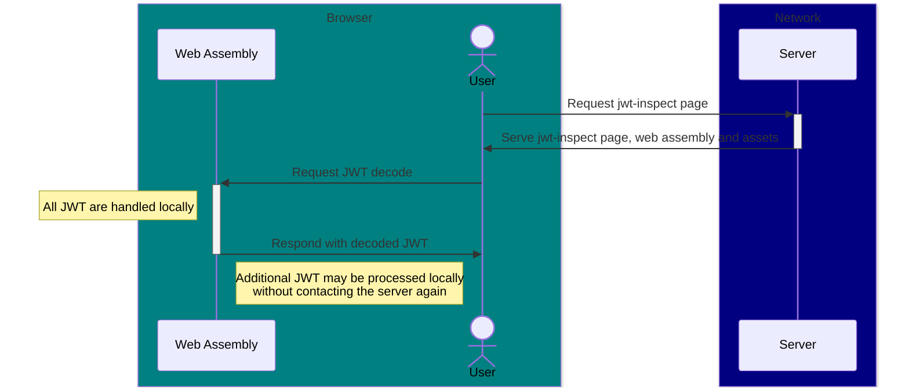

# JWT Inspect

## Why?

JWT Inspect is an attempt to make an open JWT (JSON Web Token) decoding tool based entirely on golang standard libraries making it easier to reason about the security of the tool. This tool adheres closely to RFC 7519 and can be helpful for detecting tokens which are not correctly encoded as well as allowing the user to view the contents of the header and claims.

## CLI

JWT Inspect is available as a CLI binary. This can be easily compiled from source or downloaded pre-compiled from our [github releases](https://github.com/openmicrotools/jwt-inspect/releases).

The CLI will accept tokens provided as an argument or piped in from another command. It has one operative flag, `-e`, which disables processing of NumericDate fields into a more human readable format and instead prints them in their original "epoch" format. This option may be useful if a user desires to pipe the output of jwt-inspect into another program which expects NumericDate fields in their original format.

## JWT Inspect Webpage

JWT Inspect offers a webpage version of our cli tool. The JWT processing code is compiled to web assembly and served by a light weight golang container. By processing the JWT locally in the browser using Web Assembly we remove the risk that payload logging on the server's ingress leaks sensitive credentials and achieve very good performance on token decoding.



Our container can be pulled from the github container registry.

```shell
> docker pull ghcr.io/openmicrotools/jwt-inspect:latest
```
