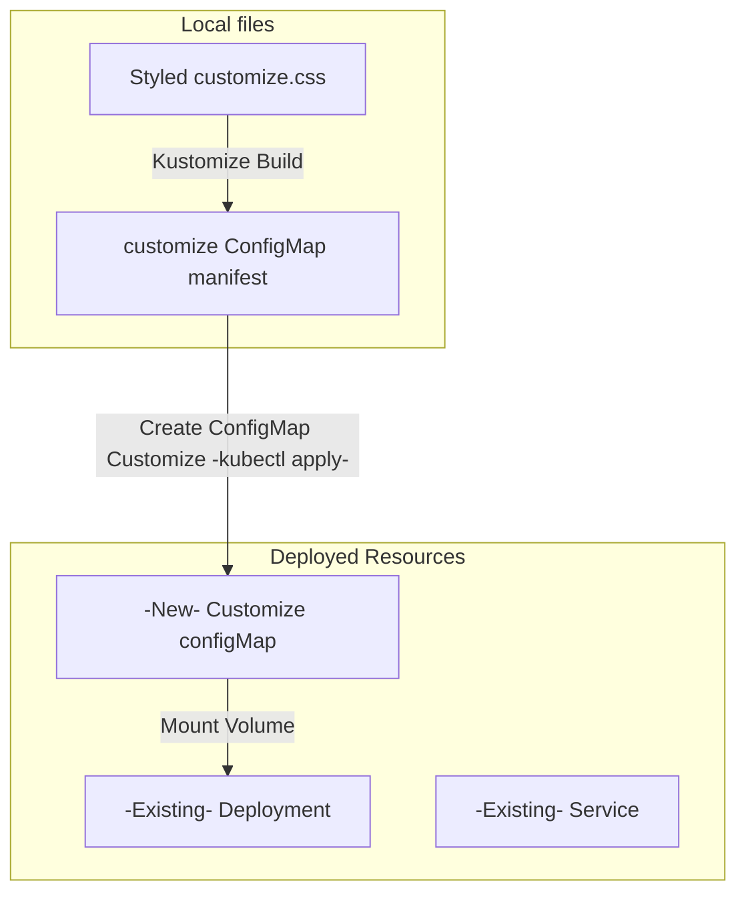

## How to Use Loadable, custom, CSS

This application supports custom CSS to match any color theme without rebuilding the image in most cases.

To add custom theming, in ```deployments/base/kustomization.yaml```  uncomment the specific section of ```configMapGenerator``` defined inside the Kustomization resource. Then, inside of ```deployments/base/deployment.yaml```, uncomment the section for ```VolumeMounts``` and ```Volumes``` at the bottom of the file.

Add changes to ```deployments/base/customize.css```, global colors are defined at the top to quickly re-skin the application. For more customization, add additional lines of css for the elements. However, Bootstrap has many classes defined with !important elements inside them, and those sections will require !important to override them. 
Any changes needed in index.html will require the image to be remade, or index.html be mounted as a configMap with the changes (will override the index.html held in the container).

If your styles are not applied after reapplying with the configMap, try restarting the pod. 


