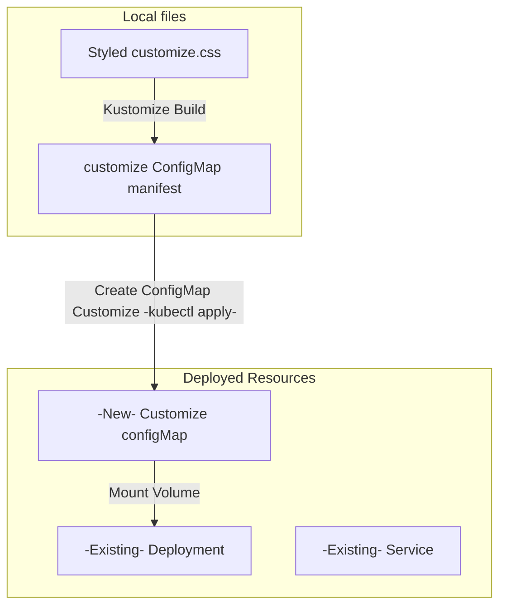

## How to Use Loadable, custom, CSS

This application supports custom CSS to match any color theme.

To add custom theming, in ```ingress/``` or ```nodeport/``` ```kustomization.yaml``` uncomment the resource ```- ../../css``` and uncomment the specific section of ```configMapGenerator``` used inside the Kustomization resource. Then, add changes to customize.css. Customize.css is loaded last in index.html so settings in it will supersede the existing styles.



# - name: index
#   files:
#   - assets/index.html